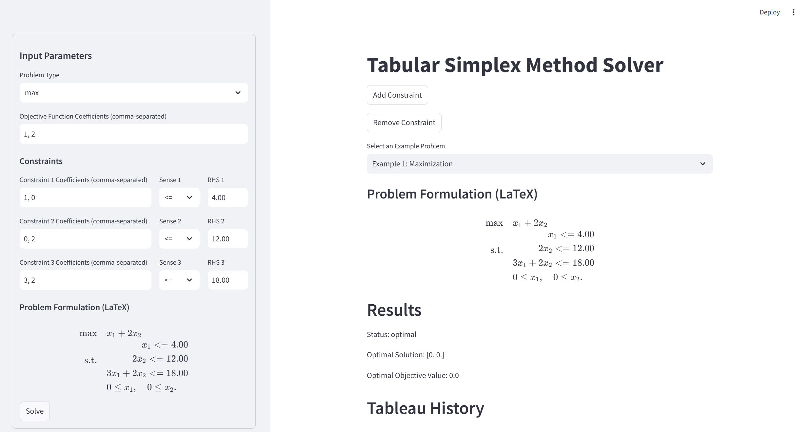

# Simplex Method Implementation


<https://simplexsolver.streamlit.app/>
This project implements the Simplex method for solving linear programming problems. It supports maximization and minimization problems, as well as different types of constraints (<=, >=, =).

## Overview

The project consists of the following main components:

- `simplex.py`: Main file containing the implementation of the tabular simplex method.
- `utils/`: Directory containing utility modules for:
  - setting up the tableau (`setup_tableau.py`),
  - transforming constraints (`transform_constraints.py`),
  - performing the pivot operation (`pivot.py`),
  - extracting the solution (`solution_extraction.py`),
  - printing the problem in LaTeX format (`latex_printer.py`),
  - validating inputs (`input_validation.py`),
  - configuring logging (`logger_config.py`),
  - testing the simplex implementation (`test_simplex.py`),
  - checking for infeasibility (`infeasibility_check.py`).
- `example_simplex.py`: Example script demonstrating how to use the simplex solver.
- `simplex_solver.py`: Another example script demonstrating how to use the simplex solver.
- `simplex.ipynb`: A jupyter notebook demonstrating the simplex method.

## Setup Instructions

1. **Prerequisites:**

   - Python 3.x
   - NumPy library

2. **Installation:**

```bash
pip install numpy
```

3. **Clone the repository:**

```bash
git clone <repository_url>
cd <repository_directory>
```

## Usage

1. **Using the `tabular_simplex` function:**

```python
from simplex import tabular_simplex
import numpy as np

# Example usage:
objective_coeffs = np.array([3, 2])
constraint_matrix = np.array([[2, 1], [1, 1]])
rhs_values = np.array([10, 8])
senses = ['<=', '<=']
problem_type = 'max'

status, x, z = tabular_simplex(objective_coeffs, constraint_matrix, rhs_values, senses, problem_type)

if status == 'optimal':
    print("Optimal solution:", x)
    print("Optimal objective value:", z)
elif status == 'unbounded':
    print("Problem is unbounded.")
else:
    print("Problem is infeasible.")
```

2.  **Example Files:**
    - Run `example_simplex.py` and `simplex_solver.py` for more usage examples.

## Project Structure

```
└── 📁.vscode
    └── settings.json
└── 📁utils
    └── infeasibility_check.py
    └── input_validation.py
    └── latex_printer.py
    └── logger_config.py
    └── pivot.py
    └── ratio_analysis.py
    └── setup_tableau.py
    └── solution_extraction.py
    └── test_simplex.py
    └── transform_constraints.py
└── 📁webapp
    └── 📁components
        └── display_results.py
        └── example_selection.py
        └── input_form.py
    └── example_problems.py
    └── 📁logic
        └── format_term.py
        └── load_example.py
        └── problem_latex.py
        └── solve_simplex.py
        └── visualize_2d.py
    └── 📁simplex
        └── __init__.py
└── .gitignore
└── example_simplex.py
└── image.png
└── readme.md
└── requirements.txt
└── simplex_solver.py
└── simplex.ipynb
└── simplex.py
└── streamlit_app.py

```

## Contributing

Feel free to contribute to this project by submitting pull requests.
